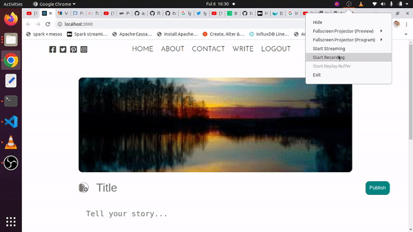

# React Blog Deployed to AWS ECS 

> A react application that enables a user to create, view, edit and delete blog articles.

<p align="center">
  
  
  
  
  
</p>

<p align=center>
  
  
</p>

</br>

<p align=center>
  
  
</p>

</br>

<p align=center>
  
</p>

## Project Overview
This is a web application frontend that enables the user to create, view, edit and delete blog posts. It works with a frontend-application that includes:

1. User Management service that is responsible for the registration of new users and authentication and authorization of resgistered users.
2. Blog service that allows an authorized user to create, view, delete and edit blog posts.
2. A search service that allows a uesr to search for particular articles.

## Working

It's pretty easy to use the application. On the home page (http://localhost:3000/):

 1. Create an account
 2. Login into created account
 2. Access all the sites functionality.

Here are sample backend-services that can be used with this front-end:

 <p align=center>
  
  
</p>

<p align=center>
  
</p>

 ## Features

 This application has several features including:

1. Deployed to an AWS ECS using Fargate.
2. Versioned using git and Hosted on GitHub and AWS CodeCommit.
3. Auto-deployed to AWS using AWS CodePipeline.
4. Uses gunicorn as the application servers.
5. Uses AWS ECR to host the container images.
6. Uses an Application Load Balancer to redirect traffic to the frontend

## Local Setup

Here is how to set up the application locally:

  1. Clone the application repo:</br>

      ```sh
      git clone https://github.com/twyle/front-end-service.git
      ```

  2. Navigate into the cloned repo:

      ```sh
      cd front-end-service
      ```

  3. Run the application:

      ```sh
      docker-compose up -f docker-compose-prod.yml up --build
      ```

 #### 1. Application Design

  1. **Services**

        
        
        This frontend enables a user to register for an account, log into the account then create, delete, view, edit and serahc for articles. Here are the application routes:

        | Route                   | Method  | Description                 |
        | ------------------------| ------- |---------------------------- |
        | '/'                     | GET     | Home page.                  |
        | '/register'             | POST    | Register a new user.        |
        | '/login'                | POST    | Login as a registered user. |
        | '/logout'               | POST    | Logout as a logged in user. |
        | 'api/v0/blog/home'      | GET     | The Blog home page          |
        | 'api/v0/blog/article'   | POST    | Create a new article        |
        | 'api/v0/blog/article'   | PUT     | Update an article           |
        | 'api/v0/blog/article'   | GET     | View an article.            |
        | 'api/v0/blog/article'   | DELETE  | Delete an article.          |
        | 'api/v0/blog/articles'  | GET     | Get many articles.          |

        1. Register as a new user with a unique email address and password as well as name.
        2. Log into your account using your email and password. 
        3. Create, edit, delete, view and serach for articles.

        Articles consist of a title, author, category an optional image url and publish and modified dates. Each title has to be uniques. The service uses Postgres database to store the article details. It also writes the article details to an sqs queue for indexing for search by the search service. It also writes writes images to an sqs queu for further procesing and storage to  S3. It also writes logs to the sqs queue.

#### 3. Development Workflow

 The application uses atleast 5 branches:

  1. Features branch used to develop new features.
  2. Development branch used to hold the most upto date features that are yet to be deployed.
  3. Staging branch holds the code that is currently being tested for production.
  4. The release branch holds all the assets used when creating a release.
  5. The production branch holds the code for the currently deployed application.

The development workflow follows the following steps:

  1. A feature branch is created for the development of a new feature.
  2. The code is then pushed to GitHub, triggering the feature-development-workflow.yml workflow. If all the tests pass, the feature is reviewde and merged into the development branch.
  3. The code in the development branch is then deployed to the development environment. If the deployment is succesful, the development branch is merged into the staging branch.
  4. This triggers the staging workflow. If all the tests are succesful, this branch is reviewed and deployed to a staging environment.
  5. For creatinga release, the staging branch is merged into the release branch. This happens when a tag is pushed to GitHub.
  6. Once a release is created, the release branch is merged into the production branch, which is deployed into production.

## Deployment (image)

The deployemt process for this application can be divided into two groups:

 * Initial Deployment
 * Incremental deployment

The initial deployment describes the first deployment to the AWS ECS Fargate cluster. The process involves the following steps:

 1. **Set up container registries on ECR for the backend and frontend images**

      Head on over to AWS and set up a container registry using ECR.

 2. **Push the service container to ECR**

      To push the created container image to ECR, you need to tag it, then sign into your account then push it:

      1. Log into ECR

        ```sh
        aws ecr-public get-login-password --region us-east-1 | docker login --username AWS --password-stdin public.ecr.aws/xxxxx
        ```

      2. Build the image

        ```sh
        docker build -f Dockerfile.prod -t image-tag:latest 
        ```

      3. Tag the image

        ```sh
        docker tag repo:latest public.ecr.aws/xxxxxxxx/repo:latest
        ```

      3. Pushto ECR registry

        ```sh
        docker push public.ecr.aws/xxxxxxxxx/repo:latest
        ```

 3. **Set up an ECS Cluster using Fargate**

      Set up an ECS cluster that uses Fargate

 4. **Set up a Task Definition for the service**

      Set up a task definition for each service. 

 5. **Create a Service for the Task**

      Set up a service for the task

 6. **Create a target group.**

      Create a target group that will be use by the load balancer to route the traffic to the service.

 7. **Set up an Application Load balancer**

      The load balancer will direct the HTTP and HTTPS traffic to our Service through the created target group.


The incremental deployment describes the process of deploying new changes to the already deployed application. It involves the following steps:

 1. Merging the new feature code into the development branch.
 2. This triggers the AWS code pipeline
 3. Codebuild builds the image and pushes it to the ecr repo thatt we created.
 4. Codedeploy pulls the latest image from ecr and gradually updates each task in the serice we created.

Here is the buildspec file:

```sh
    version: 0.2

    phases:
      pre_build:
        commands:
          - echo Logging in to Amazon ECR...
          - aws ecr get-login-password --region $AWS_DEFAULT_REGION | docker login --username AWS --password-stdin $AWS_ACCOUNT_ID.dkr.ecr.$AWS_DEFAULT_REGION.amazonaws.com

      build:
        commands:
          - echo Build started on `date`
          - echo Building the Docker image...
          - docker build -t $IMAGE_REPO_NAME:$IMAGE_TAG .
          - docker tag $IMAGE_REPO_NAME:$IMAGE_TAG $AWS_ACCOUNT_ID.dkr.ecr.$AWS_DEFAULT_REGION.amazonaws.com/$IMAGE_REPO_NAME:$IMAGE_TAG
      post_build:
        commands:
          - echo Build completed on `date`
          - echo Pushing the Docker image...
          - docker push $AWS_ACCOUNT_ID.dkr.ecr.$AWS_DEFAULT_REGION.amazonaws.com/$IMAGE_REPO_NAME:$IMAGE_TAG
          - printf '[{"name":"ecs-container","imageUri":"%s"}]' $AWS_ACCOUNT_ID.dkr.ecr.$AWS_DEFAULT_REGION.amazonaws.com/$IMAGE_REPO_NAME:$IMAGE_TAG > imagedefinitions.json
          - cat imagedefinitions.json

    artifacts:
        files: imagedefinitions.json
```

 12. **Create a hosted zone using Route53**

      Purchase a domain name from a service such as namecheap, then use that domain name to create a hosted zone on AWS using Route53.

 13. **Create an SSL Certificate for your domain**

      Use AWS Certificate manager to generate an SSL certificate for your newly created domain.

 14. **Create a record that points your application load balancer to this domain**

      To use this domain with your application, you need to:

      1. Set up a static IP for your application load balancer using the AWS static IP service.
      2. Create an A record that points to that static IP
      3. Create a listener on your ALB for HTTPS traffic.

## Releases

## v0.1.0 (2022-07-18)

### Feat

- creating the next release.
- updates the project badges.
- creates the initial layout.

## v0.0.1 (2022-07-15)

## Contribution

1. Fork it https://github.com/twyle/repo-template/fork
2. Create your feature branch (`git checkout -b feature/fooBar`)
3. Commit your changes (`git commit -am 'Add some fooBar'`)
4. Push to the branch (`git push origin feature/fooBar`)
5. Create a new Pull Request

## Developer

Lyle Okoth – [@lylethedesigner](https://twitter.com/lylethedesigner) on twitter </br>

[lyle okoth](https://medium.com/@lyle-okoth) on medium </br>

My email is lyceokoth@gmail.com </br>

Here is my [GitHub Profile](https://github.com/twyle/)

You can also find me on [LinkedIN](https://www.linkedin.com/in/lyle-okoth/)

## License

Distributed under the MIT license. See ``LICENSE`` for more information.
